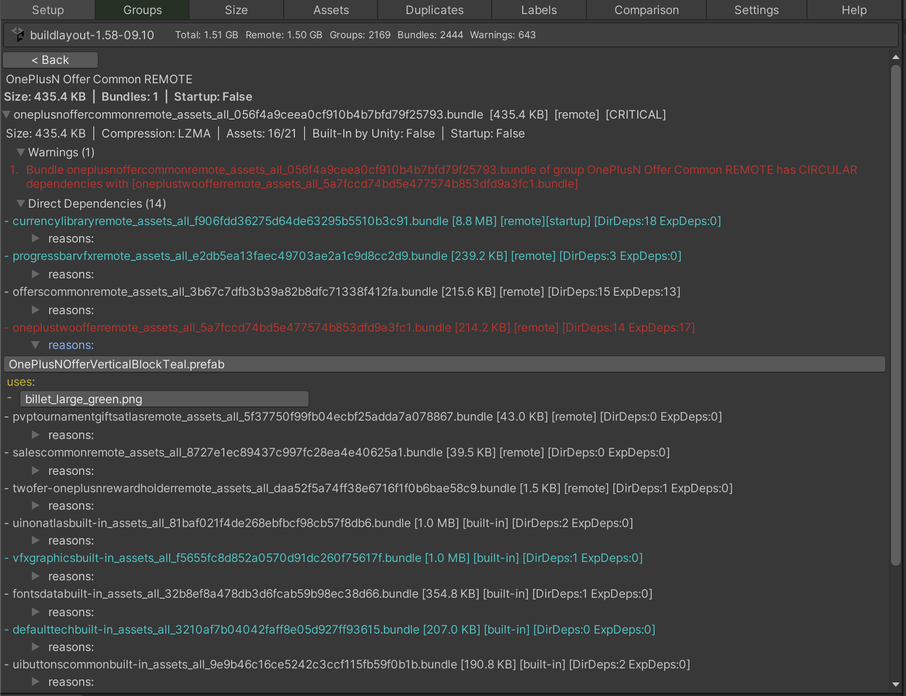
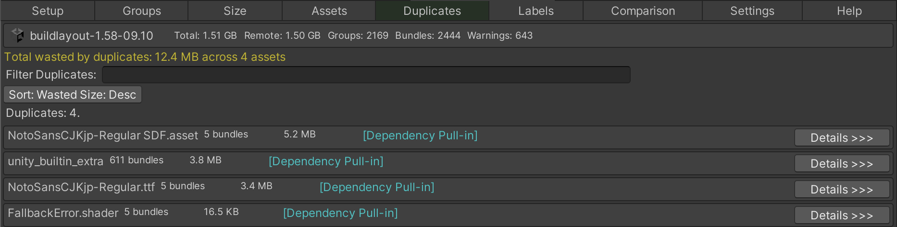
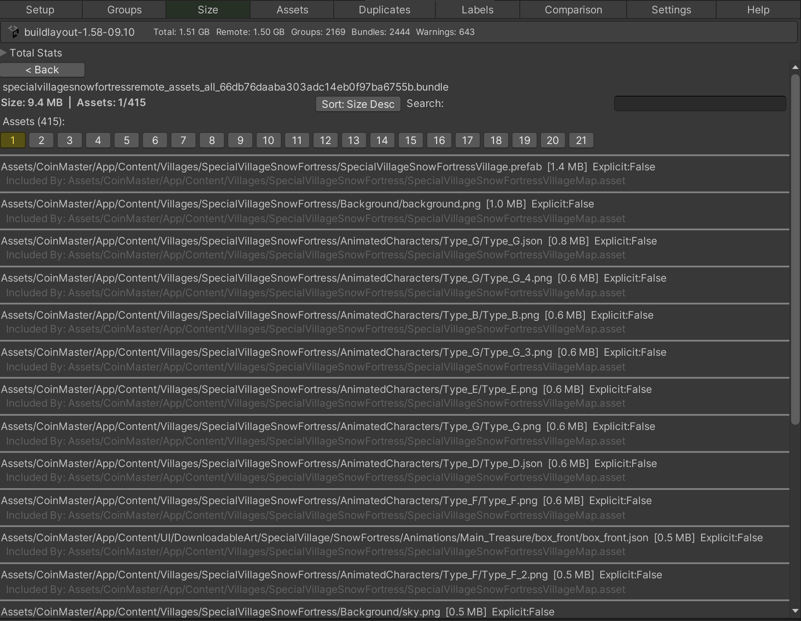
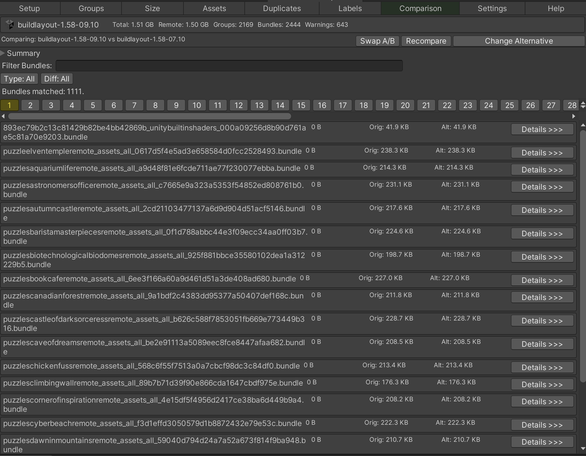

# Addressables Inspector

A Unity Editor tool for analyzing Unity Addressables build layouts. Loads `BuildLayout.txt` files and provides detailed analysis of bundles, groups, assets, duplicates, labels, and cross-build comparisons to help maintain bundle health and catch performance issues early.

## How to Use

1. **Enable BuildLayout report** in your Addressables settings:
   ```
   UnityEditor.AddressableAssets.Settings.ProjectConfigData.GenerateBuildLayout = true;
   UnityEditor.AddressableAssets.Settings.ProjectConfigData.BuildLayoutReportFileFormat = ProjectConfigData.ReportFileFormat.TXT;
   ```
2. **Build** your Addressables to generate `BuildLayout.txt` (located in your Library folder).
3. Open **Tools > Addressables Inspector**.
4. Click **Load BuildLayout.txt** in the Setup tab.

## What It Detects

### Critical Issues (Warning Level 4-5)

**Built-in bundles referencing remote bundles** (Level 5)
```
Built-In bundle [group_bundle] directly references remote bundle [remote_data]
```
A built-in (local) bundle has a direct dependency on a remote bundle. This forces Unity to download the remote bundle when acessing the built-in bundle. Usually it leads to unexpected loading and delays. If it happens at startup time it adds unexpected loading time before the user even reaches gameplay. These references often happen when an asset in a built-in group references assets that ended up in a remote group.

**Circular bundle dependencies** (Level 4)
```
Bundle [a] has CIRCULAR dependencies with [b]
```
Bundle A depends on B, and B depends on A (directly or transitively). Circular dependencies can cause issues with asset loading order, memory management, and in some cases runtime errors. Unity may struggle to resolve the load chain correctly.

**Built-in bundles transitively referencing remote bundles** (Level 4)
```
Built-In bundle [group_core] references remote bundle [remote_assets]
```
Similar to Level 5 but through an indirect dependency chain. A built-in bundle depends on another bundle, which depends on a remote bundle. This still triggers unwanted downloads.

### High-Priority Issues (Warning Level 3)

**Startup bundles with large remote dependencies** (Level 3)
```
Startup remote bundle [remote_core] references remote (non-startup) bundles with total size of 4.2 MB. Bundles: [remote_data, remote_shaders]
```
A startup remote bundle pulls in large non-startup remote bundles. This significantly increases initial load time since all of these bundles must download before the application can start. Consider restructuring to reduce what the startup chain depends on.

### Medium-Priority Issues (Warning Level 2)

**Assets containing "builtin" in their path** (Level 1)
```
Bundle [mygroup] contains builtin asset builtin_extra.unity3d
```
A bundle contains an asset whose path includes "builtin", which may indicate a duplicate with Unity's built-in assets. This wastes bundle size and can cause unexpected behavior if Unity loads its own version instead of (or in addition to) yours.

### Bundle Health Analysis

**Duplicate assets across bundles**
```
[Explicit Include] Assets/myshader.shader - in 3 bundles, wasted: 2.4 MB
```
The same asset is included in multiple bundles. Each copy adds to download size. The tool classifies duplicates as:
- **Explicit Include** — asset was directly assigned to multiple groups
- **Dependency Pull-in** — asset was pulled into multiple bundles as a dependency of different explicit assets
- **Mixed** — both causes combined

Suggested fixes are provided for each duplicate, such as moving to a shared bundle or consolidating parent assets.

| Group Analysis                        | Duplicates Analysis                       |
|---------------------------------------|-------------------------------------------|
|  |  |


| Content Size Analysis               | Layout Comparison                         |
|-------------------------------------|-------------------------------------------|
|  |  |


### Quality Gates

Define thresholds in Settings to turn analysis into automated quality gates:

| Gate | What It Checks |
|------|---------------|
| Max Total Size | Fail if total bundle size exceeds limit |
| Max Duplicate Waste | Fail if total wasted bytes from duplicates exceeds limit |
| Max Startup Remote Deps | Fail if any startup bundle pulls in too much remote content |

Set to 0 to disable a gate. Enabled gates show `PASS`/`FAIL` badges in the build header.

## Tabs Overview

| Tab | Purpose |
|-----|---------|
| **Setup** | Load and reset BuildLayout files |
| **Groups** | Browse groups sorted by warning severity, inspect bundles, dependencies, and recommendations |
| **Size** | List all bundles by size with filtering, inspect assets and external references |
| **Assets** | Browse all assets with bundle membership, internal/external references |
| **Duplicates** | Find duplicated assets with wasted size, root cause analysis, and suggested fixes |
| **Labels** | Analyze addressable labels — asset count, bundle distribution, and total size per label |
| **Comparison** | Compare two build layouts side-by-side — size diffs, added/removed bundles, asset-level changes |
| **Settings** | Configure thresholds, patterns, warning filters, and quality gates |
| **Help** | General information about the tool |

## Settings

Settings are stored in `ProjectSettings/AddressablesInspectorSettings.json` and can be version-controlled. Use **Reload Settings From Disk** if you edit the file manually.

Key settings:
- **Min Warnings Level** — filter lower-severity warnings from the UI
- **Show Related Bundles** — show/hide the related bundles section in detail views
- **Startup Warn Threshold** — size threshold that promotes startup remote dependency warnings from Low to High
- **Monochrome Warnings** — show severity as text tags `[CRITICAL]`, `[HIGH]`, etc. instead of colors only
- **Quality Gates** — per-metric pass/fail thresholds shown in the build header

## Remote/Startup Bundle Detection

Bundles are classified as "remote" or "built-in" based on substring patterns applied to the bundle name (lowercased). Default remote pattern: `remote`. Startup bundles are identified as remote bundles whose name starts with a configured prefix. Both pattern lists are configurable in Settings.

## Installation

1. Using Unity's Package Manager via link https://github.com/AlexeyPerov/Unity-Addressables-Inspector.git
2. You can also just copy and paste all files inside Editor folder

## Contributions

Feel free to [report bugs, request new features](https://github.com/AlexeyPerov/Unity-Dependencies-Hunter/issues)
or to [contribute](https://github.com/AlexeyPerov/Unity-Dependencies-Hunter/pulls) to this project!

## Other tools

##### Dependencies Hunter

- To find unreferenced assets in Unity project see [Dependencies-Hunter](https://github.com/AlexeyPerov/Unity-Dependencies-Hunter).

##### Missing References Hunter

- To find missing or empty references in your assets see [Missing-References-Hunter](https://github.com/AlexeyPerov/Unity-MissingReferences-Hunter).

##### Textures Hunter

- To analyze your textures and atlases see [Textures-Hunter](https://github.com/AlexeyPerov/Unity-Textures-Hunter).

##### Materials Hunter

- To analyze your materials and renderers see [Materials-Hunter](https://github.com/AlexeyPerov/Unity-Materials-Hunter).

##### Editor Coroutines

- Unity Editor Coroutines alternative version [Lite-Editor-Coroutines](https://github.com/AlexeyPerov/Unity-Lite-Editor-Coroutines).
- Simplified and compact version [Pocket-Editor-Coroutines](https://github.com/AlexeyPerov/Unity-Pocket-Editor-Coroutines).


